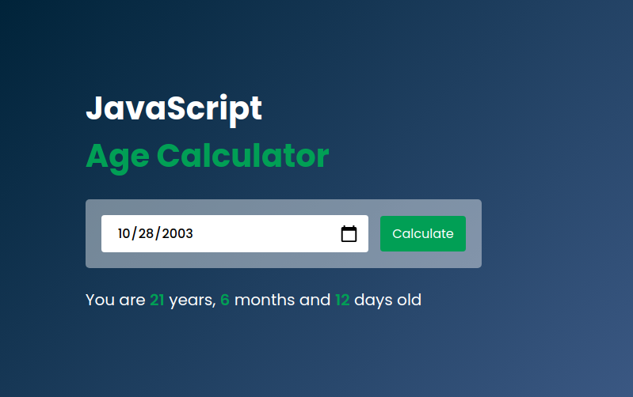

# Age Calculator Web Application



## 📌 About

This is a simple **age calculator** web application built using **HTML**, **CSS**, and **JavaScript**. The user can input their birthdate, and the app will instantly calculate their exact age in **years**, **months**, and **days**.

This project serves as a practical exercise for beginners to understand key front-end development concepts such as:

- DOM manipulation
- Event handling
- Form validation
- Basic responsive design

## 🚀 Features

- Input field for selecting birthdate
- Real-time age calculation
- Simple and intuitive UI

## 🛠️ Technologies Used

- HTML5
- CSS3
- JavaScript

## 🖥️ Getting Started

To run this project locally:

```bash
git clone https://github.com/MOHAJII/age-calculator-web-site.git
cd age-calculator-web-site
open index.html
